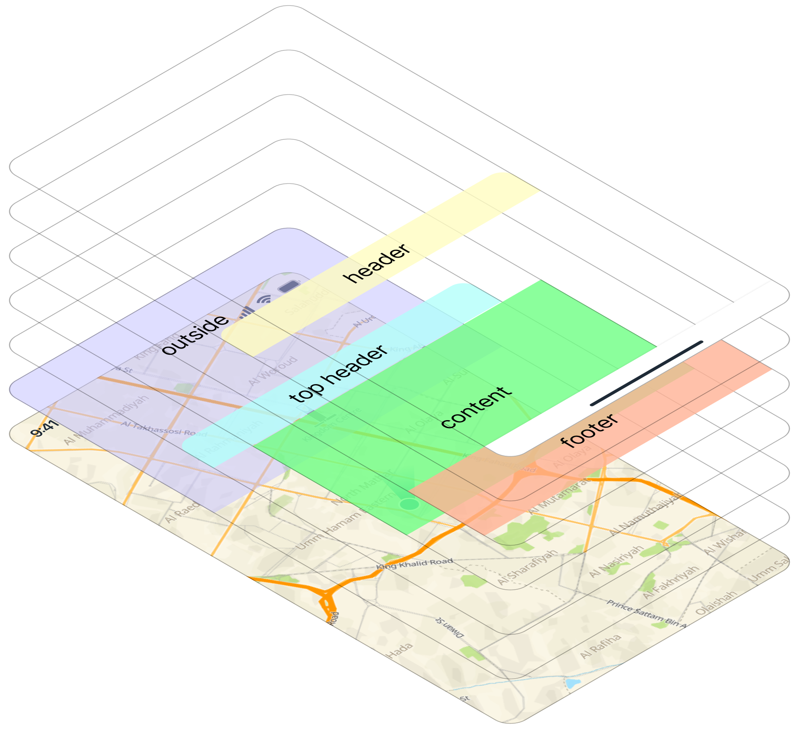

# 📦 Sheetify

**Sheetify** is a Flutter package that provides powerful and customizable bottom sheet widgets with snapping behaviors, gesture support, animation, and dynamic state control.  
It’s ideal for building screens or improving modal interactions, menus, and custom dialogs using animated, scrollable draggable sheets.

This package exposes two main widgets:
-  `MultiStateSheet`: A sheet supporting multiple snap positions and states.
-  `ToggleSheet`: A sheet with toggleable open/close states.

Both widgets are controlled via their respective controllers and support custom configurations.

  
## ✨ Features

-   📀 **Multi-state snapping** — Define multiple anchors and snap between them using configurable behaviors. 

Each `MultiStateSheetController` requires a `SnappingBehavior` and a `StateMapper`, enabling fine-tuned control over how the sheet responds to gestures and transitions. Available snapping behaviors include:
-   `SizeSnappingBehavior`: Defines snapping points in pixels.
-   `FractionSnappingBehavior`: Uses fractions of the viewport height.    
-   `ComponentsSnappingBehavior`: Calculates offsets based on component sizes (e.g., header, footer).
-   `MultiSnappingBehavior`: Combines multiple snapping models for flexible layouts.

You can also **create custom** ****``SnappingBehavior``**** and ****``SnappingModel``**** **implementations** to define your own snapping logic tailored to unique layout requirements.

-   🌺 **Toggle control** — Easily open or close sheets using `ToggleSheetController`.
-   🌀 **Interpolated animations** — React to sheet transitions for custom visuals.
-   🎮 **Controllers** — Programmatically snap or toggle sheets.
-   📜 **Barrier customization** — Customize sheet fog/overlay with `barrierColorDelegate`.
-   🔀 **Gesture integration** — Smooth drag, scroll, and snap behavior.
-   🧱 **Composable UI** — Modular architecture to build complex layouts.
-   🤲 **Both modal and persistent use cases supported**.

> 🧩 **Keyboard Insets Integration**  
> The `sheetify` package includes built-in integration with the [keyboard_insets](https://pub.dev/packages/keyboard_insets) plugin.  
> It exports the plugin’s API and widgets to handle automatic layout adjustments when the keyboard appears or animates.
>
>This integration provides a persistent safe area via the `PersistentSafeAreaBottom` API class, ensures sheets to adapt smoothly to keyboard height changes.
>
> Additionally, `sheetify` exposes native observer lifecycle control through:
> -   `PersistentSafeAreaBottom.startObserving()` — Starts the native keyboard animation observer.    
>-   `PersistentSafeAreaBottom.stopObserving()` — Stops the native keyboard animation observer.
>
> Together, these APIs ensure your sheets stay visually consistent and responsive during keyboard transitions.

## 📦 Getting Started

Add this to your `pubspec.yaml`:

```yaml
dependencies:
  sheetify: ^1.0.2
  ```
  
Then import it:
```dart
import 'package:sheetify/sheetify.dart';
```

### Lint Rules with `sheetify_lint`

To help enforce best practices, we provide a companion linter package: [`sheetify_lint`](https://pub.dev/packages/sheetify_lint).

- Your application must contain an `analysis_options.yaml` with the following:
```yaml
analyzer:
  plugins:
    - custom_lint
```
 
- And needs a `custom_lint` and `sheetify_lint` packages as `dev_dependencies`:
```yaml
dev_dependencies:
  custom_lint: ^0.8.0
  sheetify_lint: ^1.0.1
```

## 📐 Sheet Layout Structure
Here's how the layout inside a `MultiStateSheet` or `ToggleSheet` is structured:



## 📘 Usage

### MultiStateSheet
  
```dart
import 'package:sheetify/sheetify.dart';

final controller = MultiStateSheetController<YourStateMapper>(
  behavior: YourSnappingBehavior(),
  stateMapper: YourStateMapper(),
);

MultiStateSheet<YourStateMapper>(
  scrollController: controller,
  barrierColorDelegate: YourStateMapper.barrierColorDelegate,
  resizeToAvoidViewPadding: true,
  hitTestBehavior: HitTestBehavior.opaque,
  backgroundColor: Colors.white,
  topHeader: YourAnimatedHeader(),
  header: YourHeader(),
  footer: YourFooter(),
  outsideOpacityDelegate: YourStateMapper.outsideOpacityDelegate,
  outside: YourOutsideWidget(),
  sliver: DecoratedSliver(
    decoration: BoxDecoration(
      color: Colors.grey.shade300,
    ),
    sliver: SliverList(
      delegate: SliverChildBuilderDelegate(
        (context, index) => ListTile(title: Text('Item #\$index')),
        childCount: 20,
      ),
    ),
  ),
)
```


### ToggleSheet

```dart
final controller = ToggleSheetController();

ToggleSheet(
  scrollController: controller,
  backgroundColor: Colors.white,
  safeAreaColor: Colors.white,
  barrierColorDelegate: ToggleSheetDelegate.func(
    (controller) => Colors.black.withOpacity(controller.interpolation * 0.6),
  ),
  hitTestBehavior: HitTestBehavior.opaque,
  topHeader: const SizedBox(
    height: 10,
    width: double.infinity,
    child: ColoredBox(color: Colors.amber),
  ),
  topHeaderOffset: 10,
  offsetOutsideWidgetByTopheader: false,
  header: YourHeader(),
  footer: SizedBox(
    height: 100,
    child: GestureDetector(
      onTap: () {
        controller.reset();
        Navigator.of(context).pop();
      },
      child: const PlaceholderContainer(text: 'Close'),
    ),
  ),
  content: [
    const PlaceholderContainer(text: 'Content 1'),
    const PlaceholderContainer(text: 'Content 2'),
  ],
)
```
  
## 🎨 Animated Components

Use built-in base classes to create animated widgets that respond to sheet state and interpolation:

```dart
class FadingHeader extends SheetAnimatedWidget<FourStateSheet> {
  const FadingHeader({super.key}) : super(defaultState: FourStateSheet.halfOpen);

  @override
  Widget build(BuildContext context, FourStateSheet state, double interpolation) {
    return Opacity(
      opacity: (interpolation),
      child: Text('My Header'),
    );
  }
}
```

### or

```dart
class FadingHeader extends SheetValueNotifierWidget<FourStateSheet> {
  const FadingHeader({super.key}) : super(defaultState: FourStateSheet.halfOpen);

  @override
  Widget build(BuildContext context, ValueNotifier<FourStateSheet> state, ValueNotifier<double> interpolation) {
    return FadeTransition(
      opacity: Animation.fromValueListenable(interpolation),
      child: Text('My Header'),
    );
  }
}
```

----------

## **🧩 Sheetify Building Blocks**

| | |
|--|--|
| Class | Description |
|**`MultiStateSheet`** | A bottom sheet that can snap between multiple predefined states (positions). It supports draggable behavior, animated transitions, slivers, custom headers/footers, and external gesture detection. Ideal for building flexible, state-driven UIs like modals or drawers. |
| **`MultiStateSheetController<StateType>`** | Controls the state of a `MultiStateSheet`, allowing you to programmatically snap between defined states. Requires a `SnappingBehavior` and `SheetStateMapper`.
| **`ToggleSheet`**| A simpler sheet with two states: open and closed. Useful for expandable widgets like menus, drawers, or bottom actions. Supports slivers, headers, footers, and full customization of animation and gesture behavior.
|**`ToggleSheetController`**|Manages the state of a `ToggleSheet`, exposing `open()` and `close()` methods and additional properties. It can be initialized with a ToggleSheetHeightModel to define a maximum height constraint for the sheet. If not provided, the sheet will size itself based on its content, up to the available viewport height.
|**`SnappingBehavior`**|Abstract class used by `MultiStateSheetController` to define where the sheet should snap. Custom behaviors can be implemented by extending this class.
|├─ `SizeSnappingBehavior`| Snaps the sheet to specific heights (in logical pixels).
|├─ `FractionSnappingBehavior`|Snaps to a percentage of the viewport height.
|├─ `ComponentsSnappingBehavior`|Calculates snap points based on the height of header/footer/components.
| └─ `MultiSnappingBehavior` | Composes multiple snapping models for complex sheet positions. Useful when you want to mix different snapping strategies in the same sheet. |
| &nbsp;&nbsp;&nbsp;&nbsp; **Snapping Models** | Models used inside `MultiSnappingBehavior` to define snapping positions: |
| &nbsp;&nbsp;&nbsp;&nbsp; ├─ `SizeSnappingModel` | Defines snap points as absolute sizes (in pixels) of the sheet. Example: `{100, 300, 600}` → snap to 100px, 300px, or 600px height. |
| &nbsp;&nbsp;&nbsp;&nbsp; ├─ `OffsetSnappingModel` | Defines snap points as offsets from the **top** of the viewport. Example: `{200, 500, 700}` on an 800px viewport → sheet heights 600px, 300px, 100px. |
| &nbsp;&nbsp;&nbsp;&nbsp; ├─ `FractionSnappingModel` | Defines snap points as fractions of the viewport height. Example: `{0.2, 0.5, 0.75}` → snap to 20%, 50%, or 75% of screen height. |
| &nbsp;&nbsp;&nbsp;&nbsp; └─ `ComponentsSnappingModel` | Defines snap points based on the layout components of the sheet (`header`, `top`, `content`, `footer`). Example: snap directly to align with the footer height. |
|**`SheetStateMapper<T>`**|Maps a logical state (e.g. `FourStateSheet.open`) to a snap index and vice versa. Required for `MultiStateSheetController`. Also defines animation delegates like `barrierColorDelegate`.
|**`ToggleSheetHeightModel`**|defines the maximum height of a ToggleSheet, allowing it to maintain a consistent layout regardless of its content.
|├─ `ToggleSnappingConfig.fixed(double height)`|Sets the sheet height to an exact pixel value.
|├─ `ToggleSnappingConfig.offset(double offset)`|Calculates the sheet height based on its distance from the top of the screen.
|└─ `ToggleSnappingConfig.fraction(double fraction)`|Sets the sheet height as a fraction of the screen height.
|**`SnapSheetStateComponent`**|Base class for widgets that react to sheet state changes (e.g. headers that fade/resize). Extend this for interpolated animations.
|├─ `SheetAnimatedWidget<State>`|Provides `state` and `interpolation` to build animated widgets.
|└─ `SheetValueNotifierWidget<State>`|Provides `ValueNotifier`s of state/interpolation for animated builders.
|**`ToggleSheetDelegate<T>`**|A delegate class used to dynamically define properties (like color, shape, padding) based on the `ToggleSheetController`.

### ✅ Common Class Relationships
 `MultiStateSheet` → controlled by `MultiStateSheetController`, which depends on `SnappingBehavior` + `SheetStateMapper<T>`

 `ToggleSheet` → controlled by `ToggleSheetController`, which depends on a `ToggleSnappingConfig`

Animated components → extend `SheetAnimatedWidget<T>` or `SheetValueNotifierWidget<T>` for state-aware UI

Delegates → such as `ToggleSheetDelegate` provide custom behavior for colors, padding, shapes, etc.
 

## **📱 Example App**

See the `/example` folder for a complete demo app showcasing:
- Toggle sheet page with dynamic padding.
- Modal Multi State Sheet.
- Modal Toggle Sheet.

[](https://urbi-ae.github.io/sheetify/) 

## 💡 Why Use Sheetify?
-   Improves UX with interactive sheets. 
-   Easily composable and extendable.
-   Works with both modal and persistent layout patterns    
-   Lightweight, efficient and fully customizable.

## 🚀 Real-World Examples

We are using **Sheetify** package inside `Balady` - Map application

||||
|--|--|--|--|
|||||

- Uses `MultiStateSheet` and `ToggleSheet` for most of the screens in the app.
- Dynamic header and album art transitions
- Gesture-driven drag and resize


## 🚧 Roadmap

-   Add support for open directions for the sheets.
    
-   Improve accessibility and keyboard navigation.
    
-   Add controller route orchestrator to ensure smooth transitions between multiple sheet (similar behavior as a Hero widget).

  
## 🤝 Contribution

Contributions are welcome! Please open issues for bugs or feature requests. Submit pull requests with clear descriptions and tests. 
See [CONTRIBUTING.md](CONTRIBUTING.md) for guidelines.

## 📜 License

BSD-2 License. See [LICENSE](LICENSE) for details.
